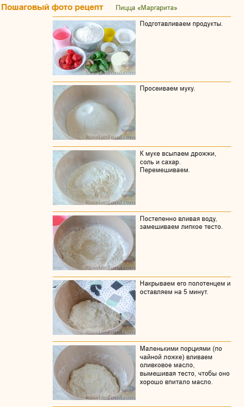

# Пицца «Маргарита»

## <mark style="color:red;">Пицца «Маргарита»</mark>

<figure><figcaption></figcaption></figure>

Пицца «Маргарита» невероятно вкусная, она так и манит своим ярким ароматом. Румяные бортики, великолепный соус из томатов в собственном соку, зелень базилика и расплавленный сыр моцарелла заставят вас вмиг окунуться в атмосферу солнечной Италии... Дрожжевое тесто для пиццы готовится "холодным способом".

| Продукты (на 4 порции)                                                           |
| -------------------------------------------------------------------------------- |
| Для теста:                                                                       |
| Масло оливковое – 15 мл + для смазывания миски                                   |
| Мука – 340 г (2 стакана по 250 мл + 2 ст. ложки без горки) + для работы с тестом |
| Вода – 240 мл                                                                    |
| Дрожжи сухие – ½ ч. ложки                                                        |
| Сахар – 14 г                                                                     |
| Соль – 7 г                                                                       |
| \*                                                                               |
| Помидоры без кожицы, консервированные в собственном соку, – 300 мл               |
| Сыр моцарелла – 200 г                                                            |
| Масло оливковое – 10 мл                                                          |
| Чеснок – 2-3 зубчика                                                             |
| Базилик зелёный свежий – 20-30 г                                                 |
| Орегано сушеный молотый – ½ ч. ложки                                             |
| Тимьян сушёный – ½ ч. ложки                                                      |
| Сахар – 1 ч. ложка                                                               |
| Соль – 1 щепотка                                                                 |

\

<figure><figcaption></figcaption></figure>

<figure><figcaption></figcaption></figure>

<figure><figcaption></figcaption></figure>

<figure><figcaption></figcaption></figure>
